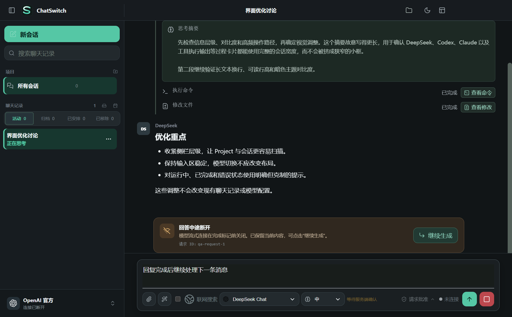
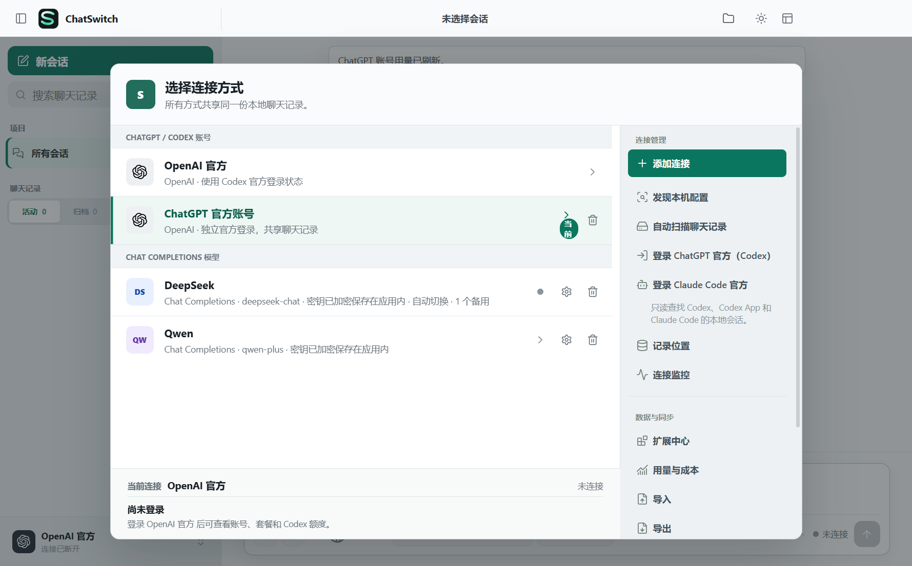
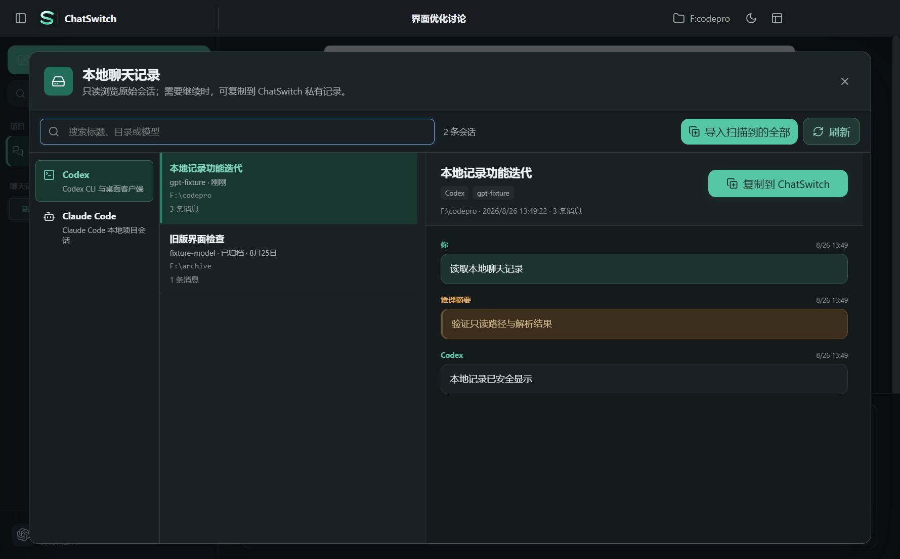
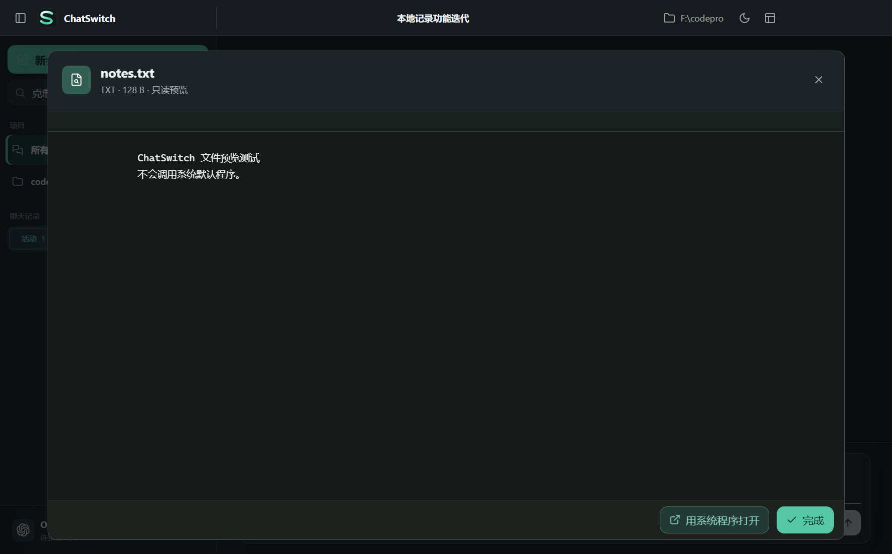
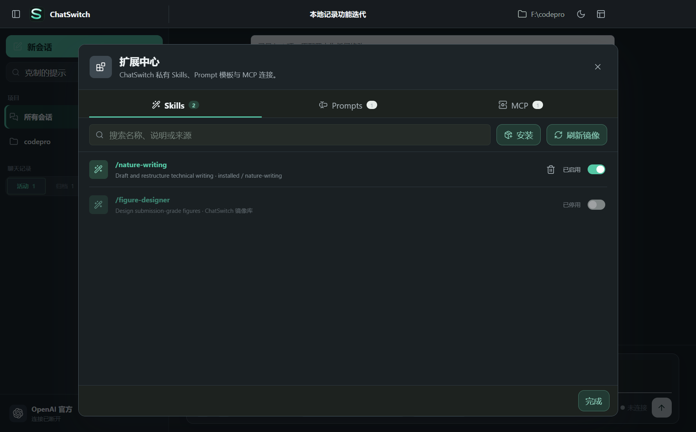
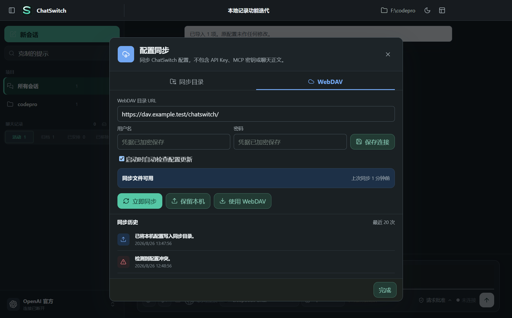

<h1 align="center">💬 ChatSwitch</h1>

<p align="center">
  <strong>一段对话，随时切换模型，继续完成工作</strong>
</p>

<p align="center">
  把 ChatGPT / Codex、Claude Code、DeepSeek、Qwen 与 OpenAI 兼容服务放进同一个桌面工作区。<br />
  集中管理聊天记录、文件上下文、执行活动、Skills、Prompt、MCP 和后台任务。
</p>

<p align="center">
  <a href="https://github.com/MttJelly/chatswitch/releases/latest"></a>
  <a href="https://github.com/MttJelly/chatswitch/actions/workflows/quality.yml"></a>
  
  
</p>

<p align="center">
  <a href="https://github.com/MttJelly/chatswitch/releases/latest/download/ChatSwitch-portable-win-x64.zip"><strong>📦 下载 ZIP 便携版</strong></a>
  &nbsp;&nbsp;·&nbsp;&nbsp;
  <a href="https://github.com/MttJelly/chatswitch/releases/latest/download/ChatSwitch-setup-win-x64.msi"><strong>🪟 下载 MSI 安装版</strong></a>
  &nbsp;&nbsp;·&nbsp;&nbsp;
  <a href="docs/WORKSPACE_GUIDE.zh-CN.md"><strong>📖 查看界面与按钮指南</strong></a>
</p>

<p align="center">
  
</p>

<p align="center"><sub>统一会话、模型切换、思考摘要、命令与文件修改都在一个工作区完成。截图来自隔离测试数据。</sub></p>

---

## ✨ ChatSwitch 是什么

不同 AI 客户端各自保存聊天记录，换模型时往往需要重新复制背景、附件和任务目标。ChatSwitch 将这些来源组织成一个本地工作区：你可以只读扫描原始历史，将需要的会话复制到 ChatSwitch，再选择另一种模型继续对话。原始客户端记录不会被覆盖。

```text
ChatGPT / Codex ─┐
Claude Code ─────┼─→ ChatSwitch 共享会话 ─→ 切换模型继续聊天
API 与中转服务 ─┘             ├─→ 文件与联网搜索
                              ├─→ 命令和修改记录
                              └─→ Project、任务与扩展
```

| 🔒 本地优先 | 🔁 上下文可续接 | 🔍 过程可检查 | 🔌 连接可替换 |
| :---: | :---: | :---: | :---: |
| 配置和会话默认保存在本机 | 导入旧会话后可换模型继续 | 查看命令、修改、搜索和思考摘要 | 官方账号、Claude Code 与兼容 API 共存 |

## 🖥️ 产品界面

<table>
  <tr>
    <td width="50%" valign="top"><br /><sub>连接中心：官方账号、API、中转、模型发现、同步与用量入口</sub></td>
    <td width="50%" valign="top"><br /><sub>本地记录：只读扫描 Codex 与 Claude Code，并一键导入当前来源全部会话</sub></td>
  </tr>
  <tr>
    <td width="50%" valign="top"><br /><sub>文件预览：在应用内查看支持的文档，同时保留系统程序打开入口</sub></td>
    <td width="50%" valign="top"><br /><sub>扩展中心：集中管理 Skills、Prompt 模板与 MCP 服务</sub></td>
  </tr>
  <tr><td colspan="2" valign="top"><br /><sub>配置同步：本地目录或 WebDAV、冲突状态与同步历史</sub></td></tr>
</table>

<p align="center"><sub>所有截图均由隔离测试数据生成，不包含真实账号、API Key 或私人聊天。</sub></p>

## 🚀 核心能力

| 能力 | 当前可以完成的工作 |
| --- | --- |
| **跨模型共享会话** | 在同一逻辑会话中切换官方账号、Codex、Claude Code 或兼容模型，并将可见历史作为续接上下文 |
| **聊天记录导入** | 只读扫描 Codex CLI、Codex App 和 Claude Code；可导入单条，也可一键导入当前来源全部记录 |
| **多会话并行** | 回答在后台继续生成时切换到其他会话或窗口；完成后通过应用内状态和 Windows 通知提示 |
| **消息队列与引导** | 回答期间继续输入，选择排队发送、立即引导、停止或在中断后继续生成 |
| **消息分支** | 在任意用户或助手消息处点击“分支到新聊天”，复制此前上下文并创建独立会话，原会话不受影响 |
| **文件上下文** | 添加图片、PDF、Word、Excel、PowerPoint、文本、Markdown、CSV 和 JSON；支持的文件可在应用内预览 |
| **联网搜索** | 为当前消息显式请求联网搜索，并展示模型返回的搜索活动；实际能力取决于连接和模型 |
| **执行可见性** | 在会话中展开查看模型执行的命令和文件修改，区分运行中、完成与失败状态 |
| **会话组织** | Project、搜索、置顶、收藏、标签、归档、移除恢复，以及 Markdown、HTML、PDF、JSON 导出 |
| **连接管理** | 官方网页登录、API Key 安全存储、中转模型自动发现、连接检测、用量、价格和故障转移 |
| **扩展与自动化** | Skills、Prompt、MCP，以及一次、每小时、每天、工作日、每周或每月执行的任务 |

## 📎 文件读取与生成

ChatSwitch 会根据连接类型选择文件处理方式：OpenAI 官方 Responses API 可在确认后临时上传文件；其他兼容 API 和中转连接会先在本机提取文字，再把可见文本加入本次消息。临时上传到 OpenAI 的文件会在请求结束后发起删除。

| 格式 | 读取能力 | 说明 |
| --- | --- | --- |
| **PDF** | ✅ 支持 | 按页提取文字层；扫描版 PDF 仍需要 OCR |
| **DOCX** | ✅ 支持 | 提取全部正文段落 |
| **XLSX** | ✅ 支持 | 按工作簿顺序读取全部工作表，并标注工作表和单元格 |
| **PPTX** | ✅ 支持 | 按演示文稿顺序读取全部幻灯片，并标注页码 |
| **TXT / Markdown / CSV / JSON** | ✅ 支持 | 直接读取本地文本内容 |
| **DOC / XLS / PPT** | ⚠️ 有条件支持 | OpenAI 官方文件输入可上传；本地中转暂不提取旧版二进制 Office 文本 |
| **图片** | ✅ 支持 | 通过图片附件通道发送，能力取决于模型是否支持视觉输入 |

目前可以将单个会话生成并导出为 **Markdown、HTML、PDF 或 JSON**。ChatSwitch 暂不直接生成 DOCX、XLSX 或 PPTX 文件；模型可以生成内容与结构，但应用还没有对应的原生 Office 写入器。

> 🔐 文件默认留在本机。只有你在 OpenAI 官方连接中确认“上传并发送”后，文件才会离开设备；普通中转不会收到原始文件，只会收到本地提取后的文本。

## 🧭 常用操作

| 你想做什么 | 在哪里操作 | 结果 |
| --- | --- | --- |
| **切换模型** | 输入框下方的模型与推理强度选择器 | 当前逻辑会话保持不变，下一轮使用新连接继续 |
| **分支到新聊天** | 将鼠标移到消息上，点击分支图标 | 复制该消息之前的上下文，原会话不受影响 |
| **排队或立即引导** | 模型回答期间继续输入，使用发送按钮旁的模式 | 等当前回答完成后发送，或立即补充方向 |
| **查看命令和修改** | 展开回答中的“执行命令”“修改文件” | 查看命令、输出、文件路径和差异内容 |
| **导入全部记录** | 连接中心 → 自动扫描聊天记录 → 一键导入 | 生成去重的 ChatSwitch 私有副本，不修改源记录 |
| **预览文件** | 点击消息中的 PDF、Office、文本或图片附件 | 在 ChatSwitch 内只读预览，也可选择系统程序打开 |
| **管理扩展** | 连接中心 → Skills / Prompt / MCP | 安装、启用、测试或移除扩展 |

完整的按钮、状态和键盘操作请查看[界面与按钮指南](docs/WORKSPACE_GUIDE.zh-CN.md)。

## 🔌 连接方式

### 🟢 ChatGPT / Codex 官方

点击“登录 ChatGPT 官方（Codex）”后，ChatSwitch 会打开 OpenAI 官方网页完成验证。应用内不要求输入 ChatGPT 邮箱或密码；未完成登录时不会进入官方聊天工作区。官方返回可用信息时，账号面板会显示套餐、Codex 额度窗口、剩余额度、Credits 和重置时间。

正式安装包包含 OpenAI 连接所需运行时，不要求用户另外安装 Codex CLI 或 ChatGPT 应用。没有官方登录时，ChatSwitch 仍可通过其他 API 和中转连接独立运行。

在“应用设置 → OpenAI / Codex 运行环境”中，可以使用自动选择、优先本机 Codex、优先 ChatGPT 应用或仅使用 ChatSwitch 内置运行时。Codex CLI 和 ChatGPT 安装在其他磁盘时，也可以手动选择可执行文件；设置页会显示实际选择、可用状态和回退结果。

### 🟠 Claude Code 官方

Claude Code 使用独立的 Anthropic 官方登录入口，不与 ChatGPT 登录共用认证。若本机没有 Claude Code CLI，也可以配置 Anthropic API Token 或兼容中转服务。

### 🔵 API 与中转服务

填写 Base URL 和 API Key 后，点击“测试连接并读取模型”。ChatSwitch 只允许从供应商 `/models` 或 `/v1/models` 实际返回的列表选择模型，不要求手写未知模型 ID。已保存的 Key 显示为 `********`，测试时从 Windows 安全存储读取原值；输入新 Key 可直接替换。

## 🔁 聊天记录共享

“自动扫描聊天记录”只读查找本机 Codex、Codex App 和 Claude Code 会话。预览不会改变源文件；复制后会生成 ChatSwitch 私有会话，之后可选择任意可用连接继续聊天。同一来源重复导入会复用已有副本，不覆盖你后来在 ChatSwitch 中产生的新消息。

“记录位置”中的 Codex 历史副本支持按 15 秒、30 秒、1 分钟或 5 分钟间隔进行单向复制。它不会把 ChatSwitch 的新消息写回原始 JSONL，因此不制造两个客户端同时写入同一会话的风险。

> ☁️ WebDAV 当前同步的是配置结构，不包含聊天正文、附件、API Key 或 MCP 密钥。端到端加密的聊天增量同步仍属于后续规划。

## ⚡ 快速开始

1. 下载 MSI 安装版，或解压 ZIP 便携版。
2. 打开 ChatSwitch，选择官方登录或添加 API / 中转连接。
3. 点击“自动扫描聊天记录”导入已有会话，或直接新建 Project 和会话。
4. 选择模型与推理强度，添加需要的文件，然后开始聊天。
5. 在回答期间继续输入，按任务需要选择排队、引导、停止或切换会话。

## 📥 下载与安装

| 发行包 | 适用场景 | 下载 |
| --- | --- | --- |
| **ZIP 便携版** | 解压后运行 `ChatSwitch.exe`，适合免安装和随身使用 | [下载最新便携版](https://github.com/MttJelly/chatswitch/releases/latest/download/ChatSwitch-portable-win-x64.zip) |
| **MSI 安装版** | 标准 Windows 安装，创建桌面和开始菜单快捷方式 | [下载最新安装版](https://github.com/MttJelly/chatswitch/releases/latest/download/ChatSwitch-setup-win-x64.msi) |

Release 同时提供带版本号的安装包、稳定下载别名和 `release-manifest.json` SHA-256 清单。

## 🔐 数据与隐私

ChatSwitch 默认将私有配置和会话保存在：

```text
%APPDATA%\ChatSwitch\data
```

- API Key、Token、WebDAV 密码和 MCP 环境变量使用 Windows 安全存储加密。
- 配置导出、WebDAV 配置同步、截图和发布包不包含凭据。
- 本地记录扫描不会修改 ChatGPT、Codex 或 Claude Code 的程序文件和原始会话。
- 新安装默认是空白状态，不会自动导入外部账号、聊天记录或 API Key。
- 卸载应用不会自动删除数据目录，手动清理前请先备份需要保留的会话。

## 🗺️ 平台规划

| 平台与能力 | 当前状态 | 目标 |
| --- | --- | --- |
| **Windows x64** | 已支持 | 持续优化性能、后台任务、通知与安装体验 |
| **macOS** | 规划中 | 原生安装、安全存储、菜单栏与通知适配 |
| **Linux** | 规划中 | 主流发行版安装包和桌面环境适配 |
| **手机端** | 规划中 | 优先支持会话查看、继续发送、附件与任务通知 |
| **聊天同步** | 设计中 | 端到端加密增量事件、附件去重和多端冲突处理 |

## 📚 文档

| 文档 | 内容 |
| --- | --- |
| [中文使用指南](docs/USER_GUIDE.zh-CN.md) | 安装、连接、会话、文件、任务、同步与故障排查 |
| [界面与按钮指南](docs/WORKSPACE_GUIDE.zh-CN.md) | 主界面、连接中心和各项按钮的作用与使用方法 |
| [English User Guide](docs/USER_GUIDE.en.md) | Complete English setup and usage guide |
| [更新日志](CHANGELOG.md) | 每个版本的新增、优化与修复 |
| [发布维护流程](docs/RELEASE_PROCESS.md) | 版本、测试、构建与发布规范 |

## 🤝 致谢

ChatSwitch 能够连接不同模型、呈现丰富会话并保持桌面端体验，离不开以下厂商和开源社区。感谢他们公开的产品、协议、代码与工程实践：

| AI 与开放协议 | 桌面与前端基础设施 |
| --- | --- |
| [OpenAI Codex](https://github.com/openai/codex) | [Electron](https://github.com/electron/electron) |
| [Anthropic Claude Code](https://github.com/anthropics/claude-code) | [Vue](https://github.com/vuejs/core) |
| [DeepSeek](https://github.com/deepseek-ai/DeepSeek-V3) | [Lucide](https://github.com/lucide-icons/lucide) |
| [Qwen](https://github.com/QwenLM/Qwen3) | [Marked](https://github.com/markedjs/marked) |
| [Model Context Protocol](https://github.com/modelcontextprotocol/servers) | [DOMPurify](https://github.com/cure53/DOMPurify) |
|  | [Simple Icons](https://github.com/simple-icons/simple-icons) · [electron-builder](https://github.com/electron-userland/electron-builder) |

ChatGPT、Codex、Claude、DeepSeek、Qwen 及其他产品名称和商标归各自权利人所有。ChatSwitch 是独立项目，与上述厂商不存在隶属或官方背书关系。

## 🛠️ 本地开发

需要 Node.js 20 或更高版本。

```powershell
npm install
& '.\Start ChatSwitch.cmd'
```

构建与验证：

```powershell
npm run check
npm run test:unit
npm run test:vue-ui
npm run dist:win
```
